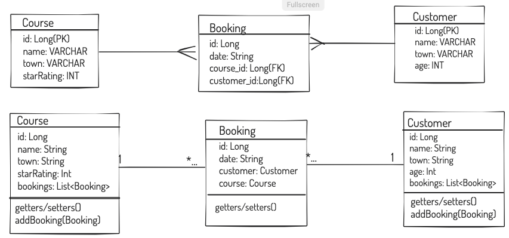

# Build a simple course booking back-end: 
- Have a RESTful API that allows connected clients to create course bookings and find useful information about the bookings created.
- The API built from scratch with Spring using Spring Boot Initialiser.

# MVP
##Models
The course reservations API needs to be built with three models with the following properties:
- Course
- [x] name - the name of the course eg: Intro to Python
- [x] town - the town/city/village where the course is located. We will not bother with full address yet.
- [x] star rating - Out of 5, each course has a rating

- Booking
- [x] date - a string in the form "dd-mm-yy" for the booking date. Dates can be in the future or in the past

- Customer
- [x] name - string containing customer's name
- [x] town - a string containing the town where the customer lives. We will not record an address at this stage
- [x] age - the customers age. Useful for marketing purposes

### The relationships should be:

- [x] A Course has many Bookings
- [x] A Booking has a Course
- [x] A Customer has many bookings
- [x] A booking has a customer

#### Queries + Custom Routes
Write queries using the derived methods. Connect these to suitable RESTful endpoints and decide whether you should use a filter or not for all of:

- [x] Get all courses with a given rating
- [x] Get all customers for a given course
- [x] Get all courses for a given customer
- [x] Get all bookings for a given date
- [x] Get all customers in a given town for a given course
- [x] Get all customers over a certain age in a given town for a given course
- [x] test these queries.

- [ ]  Correctly handle case-insensitive routes with Spring RestController or the IgnoreCase in derived queries.

- [x] GET /resources
- [x] GET /resources/{id}
- [x] GET /resources?property=value
- [x] POST /resources
- [x] PUT /resources/{id}
- [x] DELETE /resources/{id}

- [x] Clearly understand the relationships before coding. Draw it out.
- [ ] Be careful with town property - consider how to handle caps.

- [x] Write tests for your queries.

- [x] Use a ddl-auto setting of create-drop when doing development. This means every time the app starts, the schema is created, and when the app stops the schema is destroyed.
- [x] Provide a data loader to seed some initial seed data

##### Dependencies to use with spring Initialiser:
Web, JPA, H2, DevTools

